Tina Huang; Andrew Kiruluta; Sang-Ki Nam; Edward Salinas; Ning Li

# PROBLEM STATEMENT

[[WildTrack]{.ul}](https://wildtrack.org/about-us/who-we-are/) aims to
monitor wildlife as non-invasively as possible. Traditional methods of
footprint identification have relied on indigenous trackers or even
animal capture. Drawbacks of these methods include possible negative
impacts on fertility as well as cost and scale.

To address these drawbacks, teams of UC Berkeley students through the
MIDS program have endeavored to construct and deploy computer vision
methods to classify animal footprints. Past teams have developed and
trained deep-learning models to classify images. Coupled with a database
that is ever-expanding and a website to engage the public by permitting
photo-uploads, the infrastructure has proven itself as an excellent and
effective tool to extend the models and engage users. An expansion of
the dataset is crucial because existing datasets have been limited in
size.

The core WildTrack team had recently issued a call for improvements
expressing interest in a possible smartphone app that can perform
inference to engage citizen scientists as well as allow researchers to
conduct such classification in the field with or without internet
connectivity. As part of the W251 final project, our group has designed
and implemented an Android based app for image collection in the field,
inference as well as communicating this information to the cloud when
internet connectivity is available. Furthermore, exceeding expectations,
and meeting the challenges of small datasets, we have also adapted
Generative Adversarial Networks (GANs) and GAN neural-style transfer
methods to create synthetic data to augment the existing dataset as well
balance classes for species with limited numbers footprints. Finally, to
improve the overall model performance, we rebuilt and trained
classification models whose performance has surpassed that of existing
models currently deployed by WildTrack.

# Architecture Design

Multiple Footprint classification is a multi-class classification
problem. The models are trained in the cloud where GPU and storage
resources are available while a streamed version of the model is loaded
onto a smartphone app for in the field inference. Anyone with such an
app can not only collect more footprint samples for uploading to the
cloud when connectivity is available, but can also use the inference
module to get a class prediction.

For a complete end-to-end solution that allows users to download the
trained models and upload captured images as well as their input,
MQTT(Message Queuing Telemetry Transport) queues are used for data
transfer between edge and cloud. A retrain process has been implemented
to train previous models with new images allowing models to remain
up-to-date.

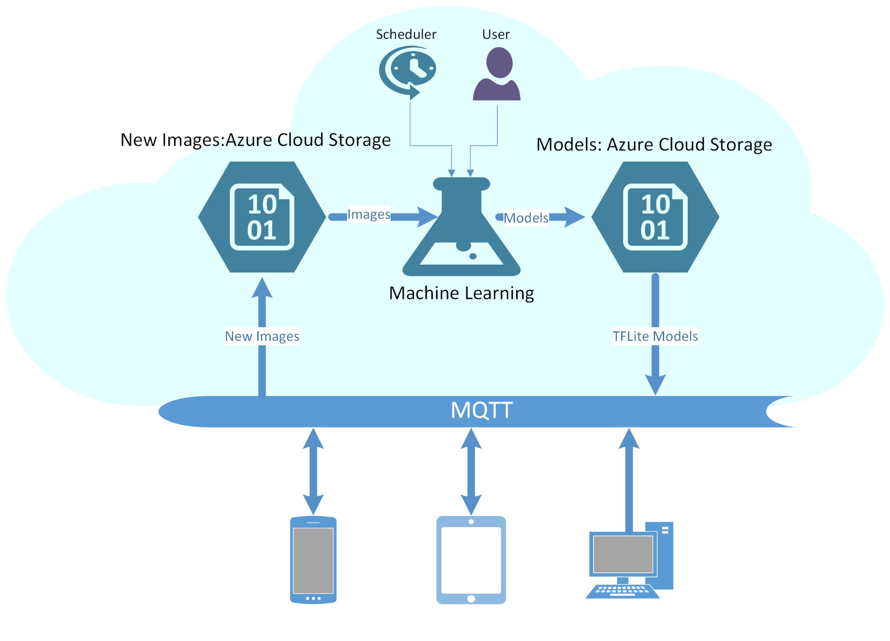

This design also provides an practical solution for following
challenges:

1.  Forgotten images - images stored on mobile phones that never make it
    > to the image repo

2.  Model Retrain - keep model updated with data changes

3.  Pushing the most recent models to edge devices

## EDA

The training and validation images are provided. We have 2931 training
images and 361 validation images belonging to 12 classes. The number of
images for each class are uneven and we expected this could negatively
affect the model performance. The histogram at right shows counts of the
12 classes :

0: \'African elephant\',1: \'African lion\',2: \'Amur Tiger\',3:
\'Bengal Tiger\',4: \'Black Rhino\',5: \'Bongo\',6: \'Cheetah\',7:
\'Jaguar\',8: \'Leopard\',9: \'Lowland Tapir\', 10: \'Otter\',11:
\'Puma\',12: \'White Rhino\'.

## Data Engineering

The images have been processed to simplify the solution - there is one
footprint on each image and all images have been labelled accordingly.

## Model augmentation

Training process involves simple image augmentations like rotation and
flipping relying mostly on more sophisticated augmentation techniques
based on GANs and neural transfer techniques as discussed in the
relevant sections below.
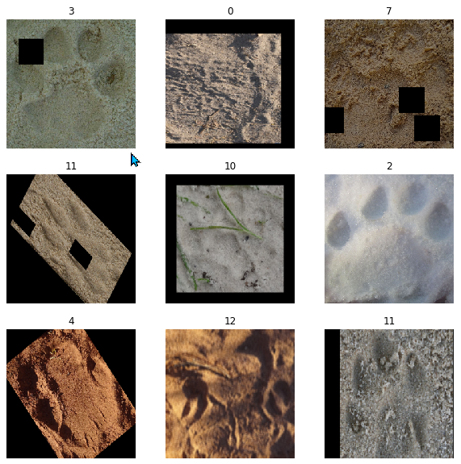

## Model Training

Given we only have a few thousand images, we decided to use transfer
learning for this task. Transfer learning is a machine learning method
where a model developed for a task is reused as the starting point for a
model on a second task.

It is a popular approach in deep learning where pre-trained models are
used as the starting point on computer vision and natural language
processing tasks given the vast compute and time resources required to
develop neural network models on these problems and from the huge jumps
in skill that they provide on related problems.

We chose to use 3 high performing models from Keras library judging from
ImageNet result - Xception, Inception and NASNet.

To use pre-trained models, we first attached an inference layer with 12
class predictors, then froze the pre-trained layers and trained the last
layer. Finally we trained the entire network.

For 3 models, the 2 smaller models Xception and Inception took 5 hours
and the largest model NASNet took 10 hours to finish.

Base models confusion matrices:

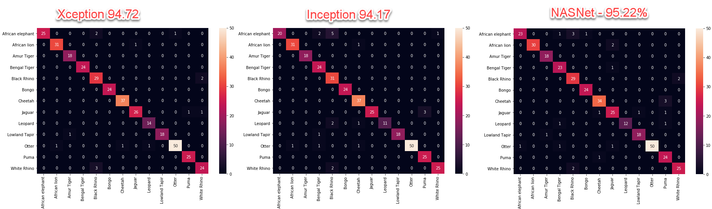

Best Tensorflow Model with GAN images:

  **Model Name**      **Parameters**   **Size**   **Validation Accuracy**
  ------------------- ---------------- ---------- -------------------------
  Xception            22,910,480       88MB       96.39%
  InceptionResNetV2   55,873,736       215MB      96.94%
  NASNetLarge         88,949,818       343MB      97.22%

Confusion matrices for the models with GAN augmented images:

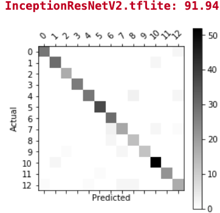

Confusion matrix for the final models:

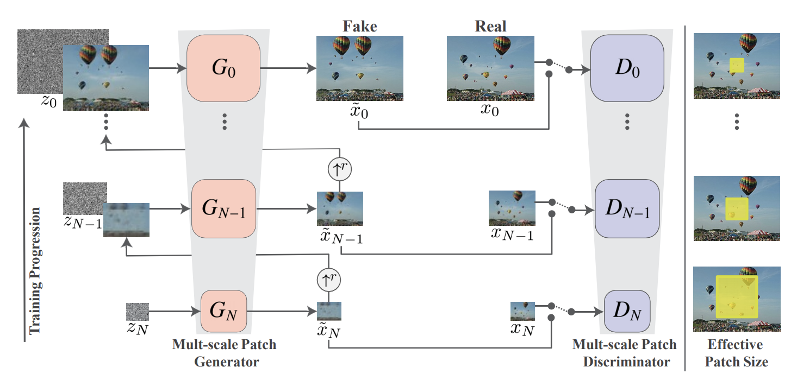

***[We note that the previous UC Berkeley MIDS/Capstone group had
validation accuracy of 95.22%; in contrast our model offers validation
accuracy of 96.39% with NasNet the best at 98.61%.]{.ul}***

## Retraining

A cloud-based retraining process has been implemented to load all images
including the most recent models and all images (including new uploaded
images) and retrain the model for improved performance. This process can
be run manually or automatically to prevent model drift. Each retrain
will create a time stamped folder and store all 3 models in the folder.

This retraining process will also convert Tensorflow models to TFLite
models for mobile inference purposes. Below are the accuracy and
confusion matrices for TFLite models. Xception TFLite model and
InceptionResNetV2 TFLite models have fairly similar validation accuracy
as that of the Tensorflow models. NASNETLarge TFlite model has the
largest drop in validation accuracy compared to the Tensorflow model:
from 95.22% to 46.11%. It remains to be investigated exactly why the
TFLite models perform poorly compared to the regular models, but we
suspect the lower model sizes are related.

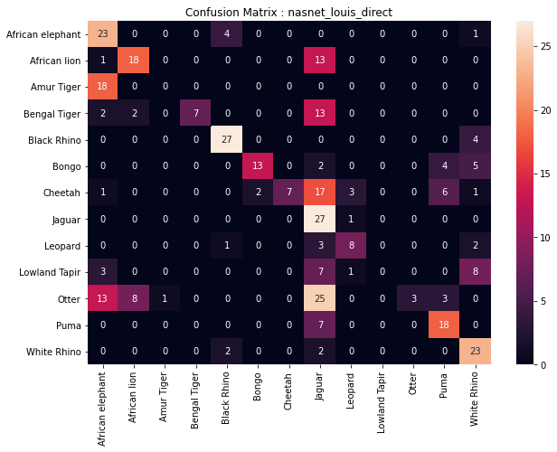

## Connection between Edge and Cloud

MQTT queue is a lightweight queue service and is used to connect edge
devices and cloud. It's used for 2 purposes:

1.  Upload mobile images to the cloud for further processing. Each image
    > is time stamped and stored in the time stamped folder. Label is
    > also provided (more details in the Cell Phone section).

2.  Download TFLite models for local inference without internet
    > connection.

# Generative Adversarial Networks (GANs):
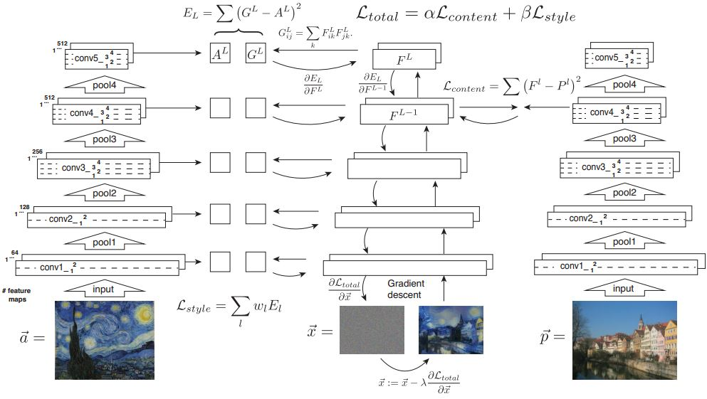
A key challenge in this work is the availability of enough training
samples to enable deep learning. In addition, some of the species tracks
are easier to obtain than others leading to significant class
imbalances.

GANs are a type of generative networks that can produce realistic images
from a latent vector or distribution. Typically, a GAN consists of two
networks: generator (G) whose purpose is to map latent code to images
and a discriminator (D) whose task is to evaluate if an image comes from
the original dataset (real image) or if it was generated by the other
network (fake image). Playing against the discriminator, the generator
tries to fool it, generating new images from the latent vector so that
the discriminator believes that they are real images. In this work, we
used a special type of network called a SinGAN.

Generative adversarial networks have proved useful in recreating
unlimited copies of images once the generator is trained. In this work,
we attempted to address the issue of creating sufficient training
samples per species as well as the generating of high resolution images
from their low resolution conterpants. GANs typically require lots of
images to train the generator. More recently, an unconditional
generative model that can be learned from a single natural image by
using versions of the same image at different scaling levels. The
network is called Single GAN ("SinGAN"). The SinGAN model is trained to
capture the internal distribution of patches within the image, and is
then able to generate high quality, diverse samples that carry the same
visual content as the image as shown in the architecture below.

SinGAN architecture consists of a multi-scale pipeline, in which a pair
of generators and discriminator are present, learning representations at
different scales. They can be trained in a coarse-to-fine fashion, where
generator and discriminator at the lowest scale learn coarse features
like background and stuff, whereas at high scales, they learn very fine
details like edges and corners.

The source image is downsampled to the respective sizes and fed into the
discriminator along with the generator's output. And the generator is
fed with the random noise along with the generated image from the
generator below them (except for last, which is fed with random noise
only). As we are dealing with only one source image, we consider a set
of patches from the downsampled source images as our real image dataset.
"You can think of patch as a sliding window which hovers over the image
and samples are collected". Usually, the patch area remained the same
for all sizes, but the effective patch size decreases as the image is
getting bigger and bigger for higher networks.

If we took a closer look at the generator, random noise vectors along
with the generated image (upsampled to noise shape) from below are
concatenated together and fed into 5 subsequent convolution layers, and
the output of convolution layers is again concatenated with the
generated image from below. This will output a new image further sent to
a discriminator along with a real image (downsampled) for evaluation.

This task is conceptually similar to the conventional GAN setting,
except that here the training samples are patches of a single image at
different resolution scales , rather than whole image samples. Some of
the sample GAN generated images for track augmentations of the various
wildlife species are shown below:

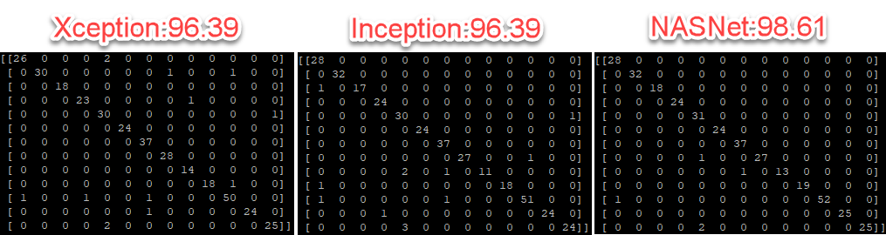

Footprint samples from SinGAN. They are practically indistinguishable
from the original samples. The trained generator is capable of
reproducing unlimited variations of these samples from sampled noise
data.

The benefit of this type of GAN is the ability to generate high
resolution images. The stakeholders at wildtrack were very interested in
converting low resolution track images into high resolution copies. Here
is an example of such with a lion footprint:

  ------------------------------------------------------------------------------------ ------------------------------------------------------------------------------------
   # MODELS 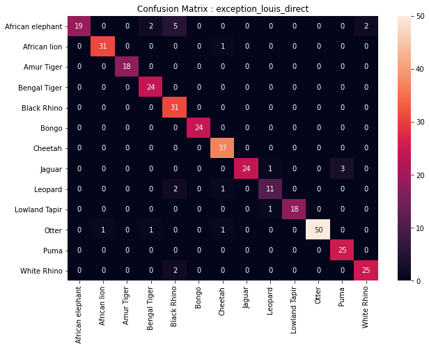
  ------------------------------------------------------------------------------------ ------------------------------------------------------------------------------------

An example of generation of high resolution images from a single low
resolution example. Here is depicted high resolution generated copies of
a lion footprints.

# Neural Style Transfer

In addition to GAN, Neural Style Transfer (NST) is also employed for
image augmentation in the project. NST is a technique to generate a new
image by applying stylistic features of a style image onto a content
image while retaining the content's overall structure
(https://arxiv.org/abs/1508.06576). It can generate a footprint image
with snow from a footprint image with dust by applying the style of snow
image or it can generate a footprint image with black dust from a
footprint image with brown sand by applying the style of black dust
image. Therefore this technique can be used for data augmentation by
generating images that are difficult to get in real situations.

The neural style transfer model is shown in figure below
([[https://www.mikegao.net/graphics/summary/neural_style.html]{.ul}](https://www.mikegao.net/graphics/summary/neural_style.html)).
The NST takes three images, a content image, a style image, and the base
image which will look like the content image with the style of the style
image. It employs the pre-trained neural network model to extract the
image features from the content image and the style image. The model
parameters do not need to be updated during the training. The base image
is the only variable that needs to be updated in the style transfer
process. In the figure below, the pre-trained neural network model has
five blocks of convolution layers and a pooling layer for downsampling
and VGG-19 is employed as the pre-trained neural network in the project.
The output of each layer of the network can be used to extract the
features of content image and style image. In our model, the output of
the fourth layer is used to extract the feature of content image and
outputs of all five layers are used to extract the features of style
image. The NST computes two loss functions. One is for the content loss
and the other is for the style loss. The total loss is the sum of two
loss functions. The content loss is used to make the base image become
like the content image in terms of the content features. The style loss
function is used to make the style of the base image become like the
style image by means of the style features. The NST model finds an image
that minimizes the total loss by gradient descent or other optimization.

Some examples of NST applied to WildTrack footprint images are in the
figure below. The base image which is the generated image in the figure
is transformed to look like the content image but it is in a different
environment. One is transformed to the footprint on the snow and the
other is to the footprint on the black dust. NST, in addition to GAN
above, can be used to generate the footprint image which is difficult to
take in the real situation.

## 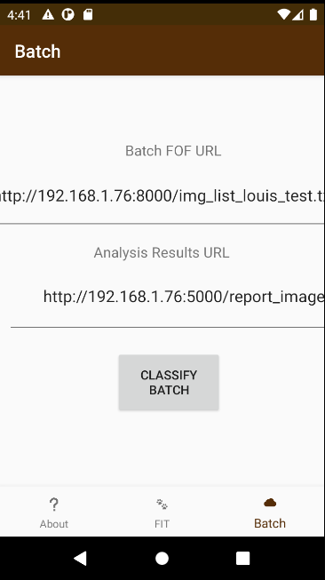

##  

## Edge - An Android App

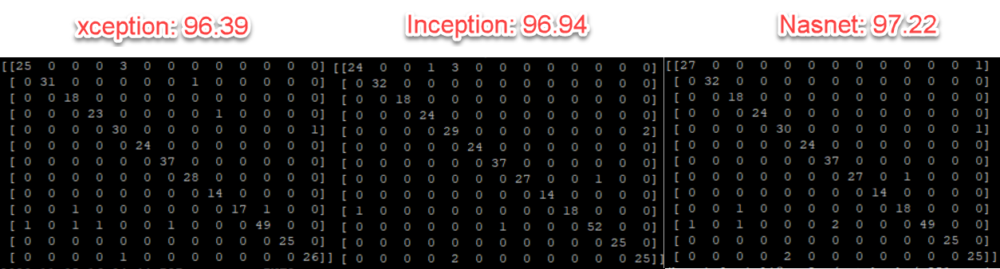

Android Studio\[1\] and the Kotlin Programming Language\[2\] were used
to write an Android smartphone app to perform classification tasks in
two principal modes: a batch mode to evaluate model performance with
numerous images and an engaging interactive "FIT" (footprint
identification technology) mode where the user loads a photo, performs a
prediction on it, and optionally uploads it to the MQTT server with a
label. A third mode also provides information about the app, but is
static only and not interactive. Testing and development used virtual
android devices including the Galaxy Nexus API 30 and the
Piex_3a_API_30_x86 ; both devices were running Android 11.
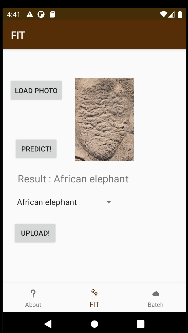
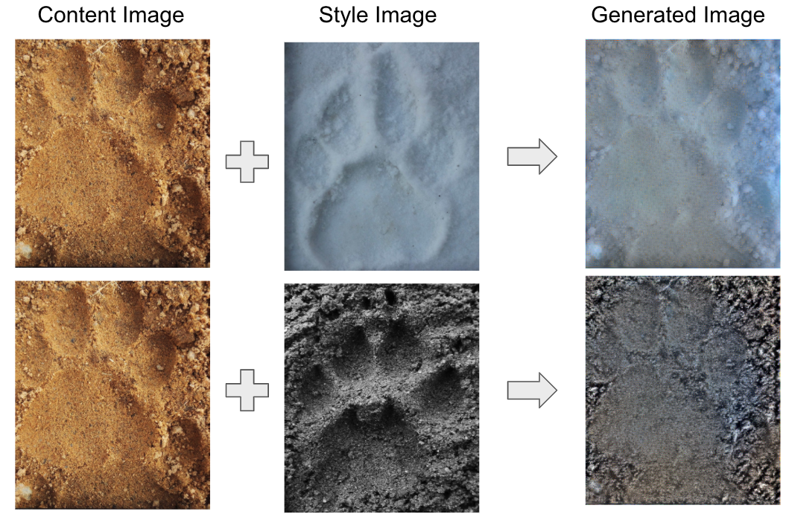

The batch mode, accessed via pressing the "Batch" button at the
bottom-right, presents to the user two text inputs. The first is a URL
interpreted by the app as a file-of-URLs ("fou"): a list of URLs of
images. Each file in the list is interpreted as an image to be
classified with a known/true label. Upon hitting the "Classify Batch"
button, the app downloads each of these images and runs each of the
three models on them. The second input presented to the user is the
analysis results URL. After each of the images in the "fou" is
classified, its results are uploaded to a web server at the
user-provided analysis results URL.

The interactive mode engages the user with images, prediction messages,
an upload "spinner", and an upload button. A typical workflow first
involves the user hitting the "Load Photo" button to select a photo from
the camera roll or from the images files on the device. After that, the
image is loaded to the UI and the user hits the "Predict" button. After
about 4 seconds of inference via tflite, the inference result is
displayed on the screen. At this point, the spinner value is updated to
reflect the prediction result. If the user is satisfied with the result,
they can hit the "Upload" button to send to the MQTT server the image as
well as the label from the spinner. If the user is not satisfied with
the result, they can use the spinner to choose their one prediction
label and then upload the image with the label to thus override the
inference output.

**TFLITE PERFORMANCE ON THE ANDROID APP**

To explore and quantify the performance of the tflite models on the
android device, the "batch" processing was carried out using the batch
mode previously described. A total of 360 files were processed. Counts
of the various labels are shown in the table ; the Otter being most
explored while the Leopard, least.

Overall, performance of the Exception and Inception models are good with
accuracies of 94% and 93%. However, performance of the NasNet model is
very poor with accuracy of 48.3%. The differences between performance in
the TFLITE batch and the regular models are remarkable. The NasNet model
is the model on the app with most opportunity for improvement, it is the
best model on the cloud; this way it is a concern but also intriguing.
Being smaller in size, tflite models may have lower precision and we
speculate this might be a cause of such differences. Detailed inspection
of the tflite models and the component layers side-by-side with the
regular models has not been done and could be a fruitful next step to
explore and perhaps discover the reasons for the discrepancies.

This table shows the performance of the 3 models on the Android edge device. 
The NASNet model clearly shows the most room for improvement on the edge device.  

Exception Model - 93.% Accuracy   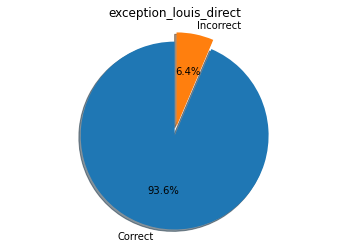

Inception Model - 92.5% Accuracy 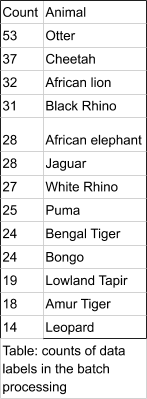 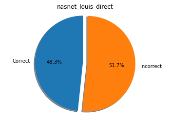

Nasnet Model - 48.3% Accuracy  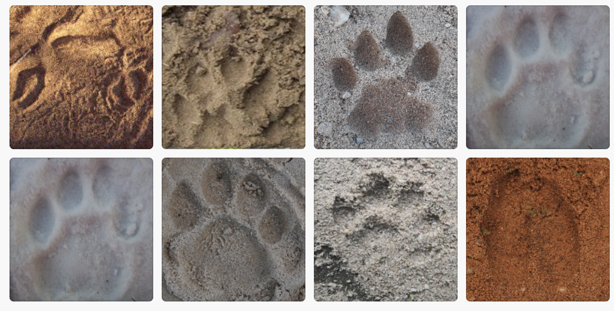 

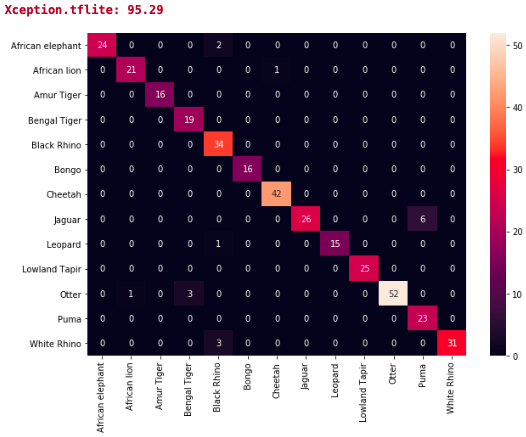

**CONCLUSION AND DELIVERABLES**

In conclusion we have implemented a cloud and edge-based architecture
for footprint classification as well as routines implementing data
augmentation (GAN/NST). Models trained via "transfer learning", namely
Xception, Inception, and NasNet now offer improvements relative to the
existing models inherited from the previous MIDS/capstone group : their
validation accuracy 95.22% with our group's performance offering
validation accuracy of 96.39% (NasNet 98.61%). Using MQTT, our android
app classifies and uploads a labeled image to the cloud taken by the
device's camera. We are pleased to offer the WildTrack group these
improvements.

*We are delivering to the wildtrack team:*

1.  Code for this group's contributions via github links

    a.  For cloud-based code as well as Android/App code

    b.  Code implementation of the MQTT pipeline/architecture

2.  Improved models (TF Models)

3.  Any technical assistance required to use the code

4.  Generated data (GAN/NST)

    a.  GAN (data augmentation & low-to-high resolution conversion) and
        > NST model files (weather conditions ; e.g. "to snow")

SUBMISSION ENGINEERING/GIT DETAILS

The project git repo is here :
[[https://github.com/louis-li/w251_final]{.ul}](https://github.com/louis-li/w251_final)

The Android App git repo is here :
[[https://github.com/eddie-a-salinas/WildTrackMobile]{.ul}](https://github.com/eddie-a-salinas/WildTrackMobile)

**REFERENCES**

Android Studio 4.0.2 , Google. (n.d.). Retrieved Nov 15, 2020 from the
Android Developer Website:
[[https://developer.android.com/]{.ul}](https://developer.android.com/)

[[https://www.tensorflow.org/lite]{.ul}](https://www.tensorflow.org/lite),
TFLite , Google Inc.

[[https://kotlinlang.org/]{.ul}](https://kotlinlang.org/) , Jetbrains
(n.d.). Retrieved Nov 15, 2020 from the Kotlin Website

SinGAN: Learning a Generative Model from a Single Natural Image by Rott
Shaham, Tamar and Dekel, Tali and Michaeli, Tomer, Computer Vision
(ICCV), IEEE International Conference 2019.

Tensorflow Keras:
[[https://keras.io/about/]{.ul}](https://keras.io/about/)

Transfer Learning and Fine Tuning:
[[https://www.tensorflow.org/tutorials/images/transfer_learning]{.ul}](https://www.tensorflow.org/tutorials/images/transfer_learning)
